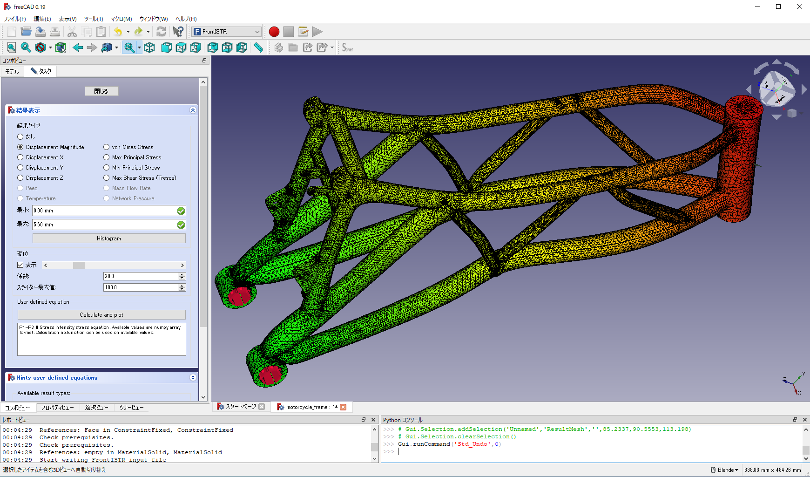

# FEM_FrontISTR: A parallel nonlinear finite element analysis workbench for FreeCAD

FEM_FrontISTR is a FreeCAD addon that enables FrontISTR, an open-source large-scale parallel FEM program for nonlinear structural analysis. See [FrontISTR Home(Japanese language website)](https://www.frontistr.com/) for the detail of FrontISTR solver.

[Motorcycle frame](https://grabcad.com/library/motorcycle-frame-6)

## Feautres

- analysis type
    - static
    - dynamic (in preparation)
    - thermal (in preparation)
    - element check
- geometrical nonlinearity
    - small(linear)
    - large deformation
- materials
    - mechanical
        - linear elastic
        - plastic (in preparation)
        - hyper elastic (in preparation)
        - creep (in preparation)
        - visco elastic (in preparation)
- loads
    - mechanical concentrated and distributed loads
    - gravity
- boundary
    - points fixed or displacement
- contact (in preparation)
- step control
    - auto time increment and cutback

## Install

### Prerequisites

- [FreeCAD v0.19 or later](https://github.com/FreeCAD/FreeCAD/releases/)

### Windows

1. Install FreeCAD.
2. Download or git clone this repository to C:/Users/user_name/AppData/Roaming/FreeCAD/Mod/FEM_FrontISTR
    - This procedure will be automated when FEM_FrontISTR is registerd to FreeCAD addon manager.
    - FrontISTR binaries will be automatically downloaded and installed on the first run.

### Linux

In preparation.

### MacOS

In preparation.

## How to use

1. Set up an analysis model by FEM module (in the same way as calculiX).
2. Switch module to "FrontISTR" and create a FrontISTR solver object.
    - SolverFISTRTools object is created in "Analysis" group
3. Open the task panel of SolverFISTRTools and set working directory.
4. Click "Write input file"
    - FrontISTR input files are generated in working directory
5. Click "Run FrontISTR"
    - FrontISTR starts in parallel and FISTR_Results object will be created after finishing calculation.
6. Check FISTR_Results for post processing.

## Documents

### FEM_FrontISTR manual and tutorial

  - English: https://frontistr-commons.gitlab.io/FEM_FrontISTR/en/
  - 日本語: https://frontistr-commons.gitlab.io/FEM_FrontISTR/ja/

### FrontISTR manual

  - English: https://manual.frontistr.com/en/
  - 日本語: https://manual.frontistr.com/ja/

## Support

### Inquiry
Create an issue at the github or post your inquiry to
https://www.frontistr.com/inquiry/.
(Membership registration is required.)

