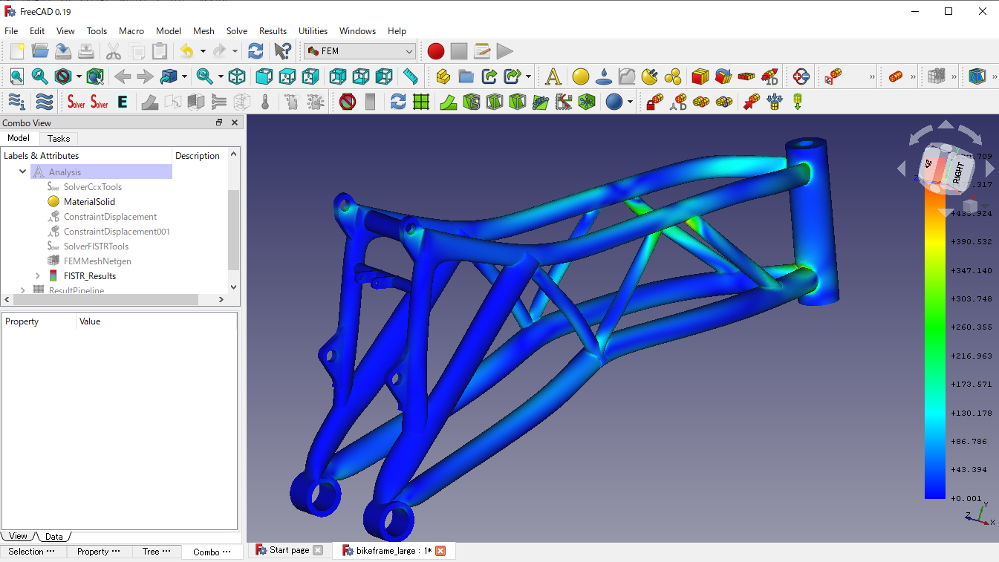

## FEM_FrontISTR: A parallel nonlinear finite element analysis workbench for FreeCAD

FEM_FrontISTR is a FreeCAD addon that enables FrontISTR, an open-source large-scale parallel FEM program for nonlinear structural analysis. See [FrontISTR Home (Japanese website)](https://www.frontistr.com/) for the detail of FrontISTR solver.


Fig: [Motorcycle frame](https://grabcad.com/library/motorcycle-frame-6), 364,807 nodes and 76,900 elements, calculation time is 31.4sec ( 82.5sec by calculix ) with Intel Core i7-6700 @3.40GHz x 4cores x 1CPU, 16.0GB Mem. Check [sample/benchmarks](./sample/benchmarks/) and [sample/showcase](./sample/showcase/README.md) for more samples.


## Features

FrontISTR is a nonlinear structural analysis solver with the following capabilities:

- analysis type
    - static
    - dynamic\*
    - thermal\*
    - element check
- geometrical nonlinearity
    - small(linear)
    - large deformation
- elements
    - 1st/2nd order tetrahedron
    - 1st/2nd order prism\*
    - 1st/2nd order hexahedron(F-bar, B-bar, Incompatible)\*
    - beam\*, shell\*, truss\*
- materials
    - mechanical
        - linear elastic
        - plastic\*
        - hyper elastic\*
        - creep\*
        - visco elastic\*
- loads
    - mechanical concentrated and distributed loads
    - gravity
- boundary
    - points fixed or displacement
- contact\*
- step control
    - auto time increment and cutback
- linear equation solver
    - Iterative
        - preconditioner: AMG, SSOR, Diagonal, ILU(k)(k=0,1,2)
        - method: CG, BiCGSTAB, GMRES, GPBiCG
    - direct
        - MUMPS
- output file format
    - AVS, VTK&dagger;

**\*** FEM_FrontISTR support is currently under preparation.  
**&dagger;** Paraview required

## Install

### Prerequisites

- [FreeCAD v0.19 or later](https://github.com/FreeCAD/FreeCAD/releases/)
- [Paraview](https://www.paraview.org/) (optional)

### Windows

1. Start FreeCAD and install the FEM\_FrontISTR workbench using ['Addon Manager'](https://wiki.freecad.org/Std_AddonMgr) in the tools menu.
2. Restart FreeCAD.
3. Switch to the FrontISTR workbench and open the first FrontISTR solver object. The FrontISTR binaries will be automatically downloaded and installed during the initial run.

<details>
    <summary>
        <i>Directions for manual install of FEM_FrontISTR if unsuccessful</i>
    </summary>
<br/>

If Installation via the FreeCAD Addon Manager is unsucessful, download or `git clone` this repository to `C:/Users/user_name/AppData/Roaming/FreeCAD/Mod/FEM_FrontISTR`

If the automatic download of FrontISTR binaries does not proceed, please follow the steps below to install the solver.
1. Download [FrontISTR-latest.zip](https://www.frontistr.com/download/link.php?https://frontistr-commons.gitlab.io/FrontISTR/release/x86_64-w64-mingw32-msmpi/FrontISTR-latest.zip)
2. Create directory `FEM_FrontISTR/bin`
3. Extract `FrontISTR-latest.zip` and put all files in the `FEM_FrontISTR/bin` directory.

</details>

### Linux

- Ubuntu 20.04 is supported.
- It is recommended to use FreeCAD AppImages.

1. Download and install the FrontISTR official deb package using the following command:
  ```
  curl https://frontistr-commons.gitlab.io/FrontISTR/release/deb/FrontISTR_master-0+ubuntu2004_amd64.deb -O
  sudo apt-get install -y ./FrontISTR_master-0+ubuntu2004_amd64.deb
  ```
2. Start FreeCAD and install the FEM\_FrontISTR workbench using ['Addon Manager'](https://wiki.freecad.org/Std_AddonMgr) in the tools menu.
3. Restart FreeCAD.

### MacOS

Under preparation.

## Usage

1. Set up an analysis model via the FEM workbench (in the same way as calculiX).
2. Switch to the "FrontISTR" workbench and create a FrontISTR solver object.
    - `SolverFISTRTools` object is created in "Analysis" group
3. Open the task panel of SolverFISTRTools and set working directory.
4. Click `Write input file`
    - FrontISTR input files are generated in working directory.
5. Click `Run FrontISTR`
    - FrontISTR starts in parallel and FISTR_Results object will be created after finishing calculation.
6. Check FISTR_Results for post processing.

## Documentation

### Tutorial on Youtube

  - https://www.youtube.com/playlist?list=PL9uFDa8KycPTmmh1eyEsXRL-XABFVAktc

### Manual and tutorial

  - English: https://frontistr-commons.gitlab.io/FEM_FrontISTR/en/
  - 日本語: https://frontistr-commons.gitlab.io/FEM_FrontISTR/ja/

### FrontISTR solver manual

  - English: https://manual.frontistr.com/en/
  - 日本語: https://manual.frontistr.com/ja/

### FreeCAD wiki

  - https://wiki.freecad.org/FEM_FrontISTR_Workbench

## Support

### Tips

- **What kind of linear equation solver should I set up?**
  - Try default settings, CG with AMG preconditioner, at first. As far as we know, this setting is the best for many large-scale models.
  - If the iterative solver is slow to converge, consider the direct solver, MUMPS. In our experience, the convergence of the iterative solver can be very slow for extremely elongated or flat shapes.
- **What value should I set Matrix Solver Residual to?**
  - The larger the matrix solver residual value, the faster you can finish the calculation, but the less accurate the solution will be.
  - Default value 1.0e-6 is for linear static analysis and enough for many models. If you are running a nonlinear analysis, you can set this value to around 1.0e-2 or 1.0e-3. This is because the Newton iteration limits the magnitude of the residual force and thus ensures the accuracy of the solution, even if the convergence threshold of the linear equation is loosened.

### Inquiry

Create an issue at the github or post your inquiry to
https://www.frontistr.com/inquiry/.
(Membership registration is required.)


## Acknowledgements
This program was funded by [FrontISTR Commons](https://www.frontistr.org/) and developed with the cooperation of [RICOS Co. Ltd.](https://www.ricos.co.jp/).

## License
GPLv3 (See [LICENSE](LICENSE) file).