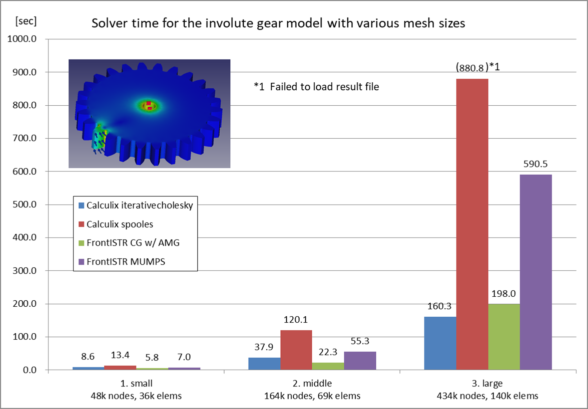

# Benchmark 01: Involute Gear

## Settings

- Objective: To compare the performance of CalculiX and FrontISTR on various mesh sizes and matrix solvers
- Model: Involute gear generated with the part design workbench
  - Analysis type: Static linear
  - Note: This model is massive and favorable for iterative solvers.
- Parameters:
  - Mesh settings: Netgen, Fineness=Moderate, First order
    1. Small: Max. Size=1.00, 48,161 nodes, 35,554 elements
    2. Middle: Max. Size=0.60, 163,686 nodes, 69,200 elements
    3. Large: Max. Size=0.40, 433,870 nodes, 140,422 elements
  - Matrix solver settings
    - CalculiX: iterativecholesky(iterative), spooles(direct)
    - FrontISTR: CG w/ AMG preconditioner(iterative), MUMPS(direct)
- Measurement Environment
  - OS: Windows 10 Pro 10.0.19041 N/A Build 19041
  - CPU: Intel Core i7-6700 @3.40GHz 4cores x 1CPU
  - Memory: 16GB
  - FreeCAD 0.19.1 a88db11
  - FrontISTR v5.2 1a5263e1
  - FEM\_FrontISTR 96abb945
  - Parallel settings
    - Calculix: `OMP_NUM_THREADS=4`
      - Note that Iterativecholesky solver runs sequentially. The other processes are executed in parallel.
    - FrontISTR: `n_process=4`
- Measurement method
  - Write Input Time(Tw): read from "Time: xx.x" at the bottom of the task panel when "Write input file" is complete
  - Solver time(Ts): read from "xx.x:  [FrontISTR/CalculiX] done without error!" message in FEM Console
  - Total time(Tt): read from "Time: xx.x" at the bottom of the task panel when "Run [FrontISTR/CalculiX]" is complete
  - Loading result time(Tr): Total time - Solve time
  - Max von Mises Stress: read from [FISTR|CCX]_Results

## Results

The performance(Solver time) of CalculiX and FrontISTR for the involute gear model is as follows:

The detailed result table including write Input time, result loading time, Mises stress, and iterative solver information is as follows:

| model     | Solver    | Matrix Solver     | Tw (sec) | Ts (sec)  | Tt (sec) | Tr (sec) | Max Mises(MPa) | iter | residual | threshold |
| --------- | --------- | ----------------- | -------- | --------- | -------- | -------- | -------------- | ---- | -------- | --------- |
| 1. small  | Calculix  | iterativecholesky | 4.8      | 8.6       | 18.7     | 10.1     | 334.16         | 151  | 2.02E-04 | 2.24E-04  |
|           | Calculix  | spooles           | 4.3      | 13.4      | 23.1     | 9.7      | 334.16         | N/A  | N/A      | N/A       |
|           | FrontISTR | CG w/ AMG         | 6.9      | **5.8**   | 14.3     | 8.5      | 334.16         | 11   | 6.64E-07 | 1.00E-06  |
|           | FrontISTR | MUMPS             | 6.1      | 7.0       | 15.3     | 8.3      | 334.16         | N/A  | 2.25E-12 | N/A       |
| 2. middle | Calculix  | iterativecholesky | 18.4     | 37.9      | 75.8     | 37.9     | 397.31         | 237  | 1.13E-04 | 1.24E-04  |
|           | Calculix  | spooles           | 19.1     | 120.1     | 151.2    | 31.1     | 397.37         | N/A  | N/A      | N/A       |
|           | FrontISTR | CG w/ AMG         | 26.7     | **22.3**  | 40.5     | 18.2     | 397.37         | 11   | 6.88E-07 | 1.00E-06  |
|           | FrontISTR | MUMPS             | 25.2     | 55.3      | 77.2     | 21.9     | 397.37         | N/A  | 4.53E-12 | N/A       |
| 3. large  | Calculix  | iterativecholesky | 55.5     | **160.3** | 265.7    | 105.4    | 442.03         | 544  | 6.19E-05 | 6.50E-05  |
|           | Calculix  | spooles           | 50.8     | 880.8     | N/A*     | N/A*     | N/A*           | N/A  | N/A      | N/A       |
|           | FrontISTR | CG w/ AMG         | 79.4     | 198.0     | 256.3    | 58.3     | 442.02         | 12   | 3.06E-07 | 1.00E-06  |
|           | FrontISTR | MUMPS             | 74.4     | 590.5     | 651.5    | 61.0     | 442.02         | N/A  | 9.37E-12 | N/A       |

\*Problem on frd file import. No nodes found in frd file.