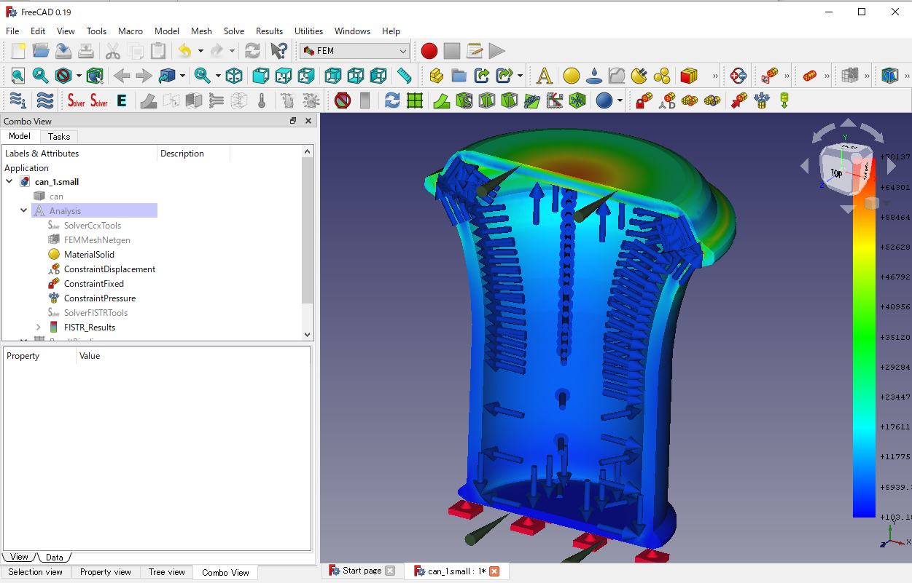
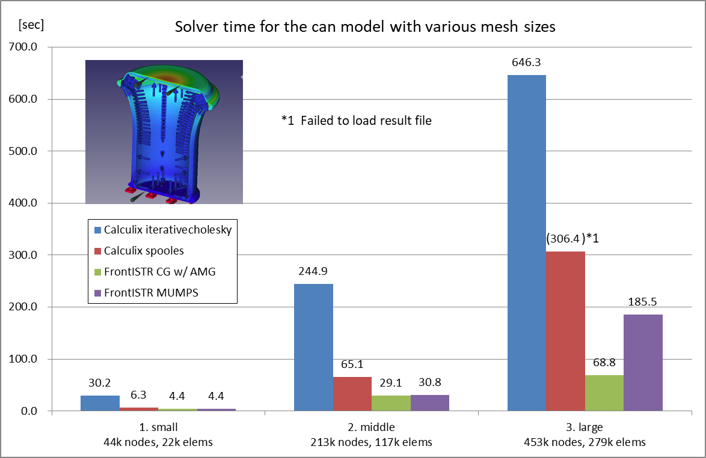

# Benchmark 02: Internal Pressure of a Can

## Settings

- Objective: To compare the performance of CalculiX and FrontISTR on various mesh sizes and matrix solvers
- Model: A can with internal pressure imported from the tutorial of Revocap/Prepost
  - Analysis type: Static linear
- Parameters:
  - Mesh settings: Netgen, Fineness=Moderate, Second order
    1. Small: Max. Size=8.00, 44,013 nodes, 22,059 elements
    2. Middle: Max. Size=4.00, 213,449 nodes, 116,590 elements
    3. Large: Max. Size=3.40, 453,393 nodes, 279,431 elements
  - Matrix solver settings
    - CalculiX: iterativecholesky(iterative), spooles(direct)
    - FrontISTR: CG w/ AMG preconditioner(iterative), MUMPS(direct)
- Mesurement Environment
  - OS: Windows 10 Pro 10.0.19041 N/A Build 19041
  - CPU: Intel Core i7-6700 @3.40GHz 4cores x 1CPU
  - Memory: 16GB
  - FreeCAD 0.19.1 a88db11
  - FrontISTR v5.2 380f1690
  - FEM\_FrontISTR 8f57d2f3
  - Paralell settings
    - Calculix: `OMP_NUM_THREADS=4`
      - Note that Iterativecholesky solver runs sequentially. The other processes are executed in parallel.
    - FrontISTR: `n_process=4`
- Measurement method
  - Write Input Time(Tw): read from "Time: xx.x" at the bottom of the task panel when "Write input file" is complete
  - Solver time(Ts): read from "xx.x:  [FrontISTR/CalculiX] done without error!" message in FEM Console
  - Total time(Tt): read from "Time: xx.x" at the bottom of the task panel when "Run [FrontISTR/CalculiX]" is complete
  - Loading result time(Tr): Total time - Solve time
  - Max von Mises Stress: read from [FISTR|CCX]_Results

## Results

The performance(Solver time) of CalculiX and FrontISTR for this model is as follows:

The detailed result table including write Input time, result loading time, Mises stress, and iterative solver information is as follows:

| model     | Solver    | Matrix Solver     | Tw (sec) | Ts (sec) | Tt (sec) | Tr (sec) | Max Mises(MPa) | iter | residual | threshold |
| --------- | --------- | ----------------- | -------- | -------- | -------- | -------- | -------------- | ---- | -------- | --------- |
| 1. small  | Calculix  | iterativecholesky | 8.5      | 30.2     | 35.0     | 4.8      | 70.14          | 1063 | 3.17E-02 | 3.67E-02  |
|           | Calculix  | spooles           | 8.3      | 6.3      | 11.1     | 4.8      | 70.14          | N/A  | N/A      | N/A       |
|           | FrontISTR | CG w/ AMG         | 9.3      | **4.4**  | 7.3      | 2.9      | 70.14          | 86   | 8.39E-07 | 1.00E-06  |
|           | FrontISTR | MUMPS             | 9.5      | **4.4**  | 7.3      | 2.9      | 70.14          | N/A  | 9.95E-12 | N/A       |
| 2. middle | Calculix  | iterativecholesky | 33.4     | 244.9    | 269.5    | 24.6     | 93.81          | 1484 | 1.07E-05 | 1.26E-05  |
|           | Calculix  | spooles           | 34.5     | 65.1     | 88.0     | 22.9     | 93.81          | N/A  | N/A      | N/A       |
|           | FrontISTR | CG w/ AMG         | 37.0     | **29.1** | 40.5     | 11.4     | 93.81          | 102  | 8.21E-07 | 1.00E-06  |
|           | FrontISTR | MUMPS             | 38.1     | 30.8     | 42.3     | 11.5     | 93.81          | N/A  | 1.90E-11 | N/A       |
| 3. large  | Calculix  | iterativecholesky | 61.0     | 646.3    | 699.8    | 53.5     | 104.25         | 1575 | 1.29E-05 | 1.08E-05  |
|           | Calculix  | spooles           | 58.0     | 306.4    | N/A*     | N/A*     | N/A*           | N/A  | N/A      | N/A       |
|           | FrontISTR | CG w/ AMG         | 71.5     | **68.8** | 93.9     | 25.1     | 104.25         | 89   | 9.61E-07 | 1.00E-06  |
|           | FrontISTR | MUMPS             | 66.3     | 185.5    | 214.6    | 29.1     | 104.25         | N/A  | 2.75E-11 | N/A       |

\*Problem on frd file import. No nodes found in frd file.