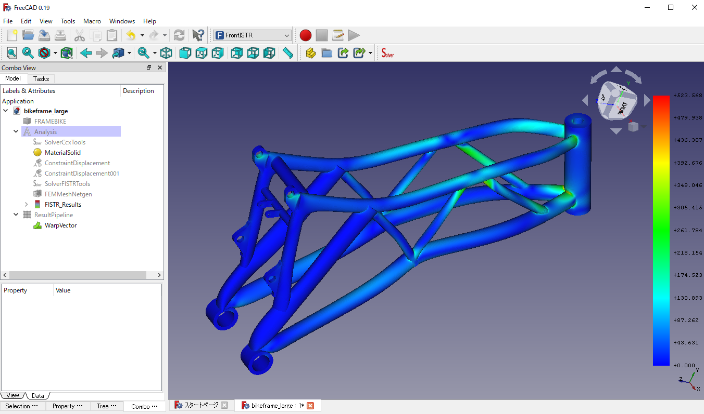

# Benchmark 03: Motorbike Frame

## Settings

- Objective: To compare the performance of CalculiX and FrontISTR on various mesh sizes and matrix solvers
- Model: Involute gear generated with the part design workbench
  - Analysis type: Static linear
- Parameters:
  - Mesh settings: Netgen, Fineness=Moderate
     1. Small: Max. Size=100.00, First order, 30,462 nodes, 46,394 elements
     2. Middle: Max. Size=10.0, Second order, 187,073 nodes, 46,206 elements
     3. Large: Max. Size=4.30, Second order, 311,150 nodes, 177,213 elements
  - Matrix solver settings
    - CalculiX: iterativecholesky(iterative), spooles(direct)
    - FrontISTR: CG w/ AMG preconditioner(iterative), MUMPS(direct)
- Mesurement Environment
  - OS: Windows 10 Pro 10.0.19041 N/A Build 19041
  - CPU: Intel Core i7-6700 @3.40GHz 4cores x 1CPU
  - Memory: 16GB
  - FreeCAD 0.19.1 a88db11
  - FrontISTR v5.2 380f1690
  - FEM\_FrontISTR 8f57d2f3
  - Paralell settings
    - Calculix: `OMP_NUM_THREADS=4`
      - Note that Iterativecholesky solver runs sequentially. The other processes are executed in parallel.
    - FrontISTR: `n_process=4`
- Measurement method
  - Write Input Time(Tw): read from "Time: xx.x" at the bottom of the task panel when "Write input file" is complete
  - Solver time(Ts): read from "xx.x:  [FrontISTR/CalculiX] done without error!" message in FEM Console
  - Total time(Tt): read from "Time: xx.x" at the bottom of the task panel when "Run [FrontISTR/CalculiX]" is complete
  - Loading result time(Tr): Total time - Solve time
  - Max von Mises Stress: read from [FISTR|CCX]_Results

## Results

The performance(Solver time) of CalculiX and FrontISTR for this model is as follows:

The detailed result table including write Input time, result loading time, Mises stress, and iterative solver information is as follows:

| model     | Solver    | Matrix Solver     | Tw (sec) | Ts (sec) | Tt (sec) | Tr (sec) | Max Mises(MPa) | iter | residual | threshold |
| --------- | --------- | ----------------- | -------- | -------- | -------- | -------- | -------------- | ---- | -------- | --------- |
| 1. small  | Calculix  | iterativecholesky | 1.2      | 4.2      | 10.4     | 6.2      | 622.82&dagger;     | 109  | 6.83E-01 | 6.89E-01  |
|           | Calculix  | spooles           | 1.2      | 3.7      | 9.9      | 6.2      | 375.31         | N/A  | N/A      | N/A       |
|           | FrontISTR | CG w/ AMG         | 2.2      | **2.6**  | 11.3     | 8.7      | 375.37         | 58   | 9.79E-07 | 1.00E-06  |
|           | FrontISTR | MUMPS             | 2.2      | 2.7      | 11.2     | 8.5      | 375.31         | N/A  | 2.52E-15 | N/A       |
| 2. middle | Calculix  | iterativecholesky | 4.0      | 61.4     | 82.3     | 20.9     | 1759.03&dagger;    | 253  | 3.35E-01 | 3.42E-01  |
|           | Calculix  | spooles           | 3.8      | 30.2     | 51.3     | 21.1     | 474.58         | N/A  | N/A      | N/A       |
|           | FrontISTR | CG w/ AMG         | 6.7      | 26.7     | 41.9     | 15.2     | 474.68         | 112  | 9.19E-07 | 1.00E-06  |
|           | FrontISTR | MUMPS             | 6.8      | **18.4** | 33.9     | 15.5     | 474.58         | N/A  | 7.51E-15 | N/A       |
| 3. large  | Calculix  | iterativecholesky | 6.7      | 165.8    | 201.4    | 35.6     | 2397.54&dagger;    | 463  | 2.54E-01 | 2.65E-01  |
|           | Calculix  | spooles           | 6.7      | 64.0     | 98.7     | 34.7     | 520.71         | N/A  | N/A      | N/A       |
|           | FrontISTR | CG w/ AMG         | 11.5     | 52.9     | 70.3     | 17.4     | 520.79         | 120  | 9.18E-07 | 1.00E-06  |
|           | FrontISTR | MUMPS             | 11.6     | **35.1** | 51.9     | 16.8     | 520.71         | N/A  | 1.03E-14 | N/A       |

\*Problem on frd file import. No nodes found in frd file.
&dagger;Iterativecholesky solver converged but the solution was inacculate. 