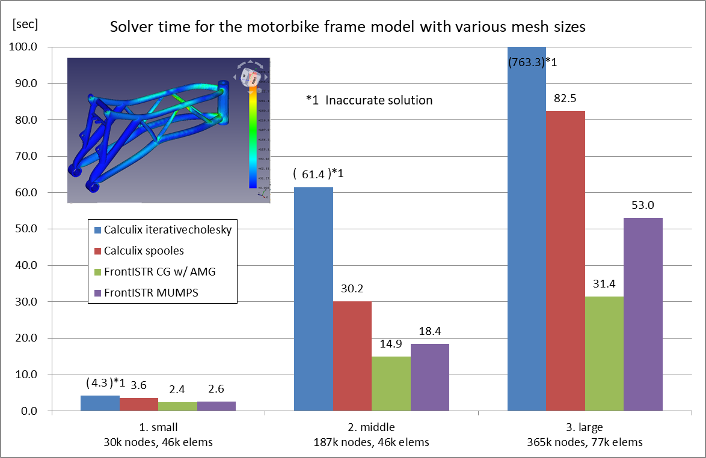

# Benchmark 03: Motorbike Frame

## Settings

- Objective: To compare the performance of CalculiX and FrontISTR on various mesh sizes and matrix solvers
- Model: Involute gear generated with the part design workbench
  - Analysis type: Static linear
- Parameters:
  - Mesh settings: Netgen, Fineness=Moderate
     1. Small: Max. Size=100.00, First order, 30,367 nodes, 46,164 elements
     2. Middle: Max. Size=10.0, Second order, 187,073 nodes, 46,206 elements
     3. Large: Max. Size=4.30, Second order, 364,807 nodes, 76,900 elements
  - Matrix solver settings
    - CalculiX: iterativecholesky(iterative), spooles(direct)
    - FrontISTR: CG w/ AMG preconditioner(iterative), MUMPS(direct)
- Mesurement Environment
  - OS: Windows 10 Pro 10.0.19041 N/A Build 19041
  - CPU: Intel Core i7-6700 @3.40GHz 4cores x 1CPU
  - Memory: 16GB
  - FreeCAD 0.19.1 a88db11
  - FrontISTR v5.2 1a5263e1
  - FEM\_FrontISTR 96abb945
  - Paralell settings
    - Calculix: `OMP_NUM_THREADS=4`
      - Note that Iterativecholesky solver runs sequentially. The other processes are executed in parallel.
    - FrontISTR: `n_process=4`
- Measurement method
  - Write Input Time(Tw): read from "Time: xx.x" at the bottom of the task panel when "Write input file" is complete
  - Solver time(Ts): read from "xx.x:  [FrontISTR/CalculiX] done without error!" message in FEM Console
  - Total time(Tt): read from "Time: xx.x" at the bottom of the task panel when "Run [FrontISTR/CalculiX]" is complete
  - Loading result time(Tr): Total time - Solve time
  - Max von Mises Stress: read from [FISTR|CCX]_Results

## Results

The performance(Solver time) of CalculiX and FrontISTR for this model is as follows:

The detailed result table including write Input time, result loading time, Mises stress, and iterative solver information is as follows:

| model     | Solver    | Matrix Solver     | Tw (sec) | Ts (sec) | Tt (sec) | Tr (sec) | Max Mises(MPa)  | iter | residual | threshold |
| --------- | --------- | ----------------- | -------- | -------- | -------- | -------- | --------------- | ---- | -------- | --------- |
| 1. small  | Calculix  | iterativecholesky | 1.2      | 4.3      | 10.4     | 6.1      | 622.82&dagger;  | 109  | 6.83E-01 | 6.89E-01  |
|           | Calculix  | spooles           | 1.2      | 3.6      | 9.7      | 6.1      | 375.31          | N/A  | N/A      | N/A       |
|           | FrontISTR | CG w/ AMG         | 2.2      | **2.4**  | 11.3     | 8.9      | 375.37          | 11   | 4.59E-07 | 1.00E-06  |
|           | FrontISTR | MUMPS             | 2.2      | 2.6      | 10.7     | 8.1      | 375.31          | N/A  | 2.52E-15 | N/A       |
| 2. middle | Calculix  | iterativecholesky | 4.0      | 61.4     | 82.3     | 20.9     | 1759.03&dagger; | 253  | 3.35E-01 | 3.42E-01  |
|           | Calculix  | spooles           | 3.8      | 30.2     | 51.3     | 21.1     | 474.58          | N/A  | N/A      | N/A       |
|           | FrontISTR | CG w/ AMG         | 6.7      | **14.9** | 29.8     | 14.9     | 474.68          | 22   | 9.68E-07 | 1.00E-06  |
|           | FrontISTR | MUMPS             | 6.8      | 18.4     | 33.9     | 15.5     | 474.58          | N/A  | 7.51E-15 | N/A       |
| 3. large  | Calculix  | iterativecholesky | 8.2      | 763.3    | 806.4    | 43.1     | 1171.69&dagger; | 5208 | 7.41E-03 | 7.52E-03  |
|           | Calculix  | spooles           | 7.9      | 82.5     | 122.1    | 39.6     | 523.58          | N/A  | N/A      | N/A       |
|           | FrontISTR | CG w/ AMG         | 13.6     | **31.4** | 50.7     | 19.3     | 523.57          | 22   | 7.36E-07 | 1.00E-06  |
|           | FrontISTR | MUMPS             | 13.8     | 53.0     | 72.4     | 19.4     | 523.58          | N/A  | 9.06E-15 | N/A       |

&dagger;Iterativecholesky solver converged but the solution was inacculate. 

