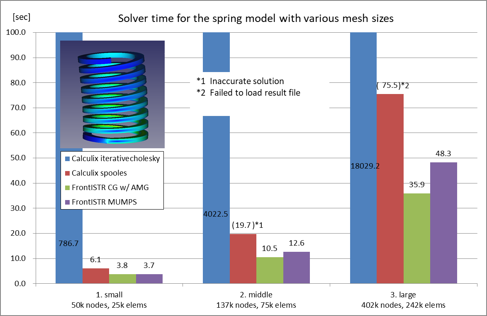

# Benchmark 04: Spring

## Settings

- Objective: To compare the performance of CalculiX and FrontISTR on various mesh sizes and matrix solvers
- Model: Spring generated with the part design workbench
  - Analysis type: Static linear
  - Note: This model is elongated and favorable for direct solvers.
- Parameters:
  - Mesh settings: Gmsh, Second order, Second Order Linear=true
    1. Small: Max element size=3.00, 49,713 nodes, 24,813 elements
    2. Middle: Max element size=2.00, 137,283 nodes, 75,058 elements
    3. Large: Max element size=1.30, 402,670 nodes, 242,045 elements
  - Matrix solver settings
    - CalculiX: iterativecholesky(iterative), spooles(direct)
    - FrontISTR: CG w/ AMG preconditioner(iterative), MUMPS(direct)
      - Set Matrix Solver Residual=1.0E-3 due to slow convergence
- Mesurement Environment
  - OS: Windows 10 Pro 10.0.19041 N/A Build 19041
  - CPU: Intel Core i7-6700 @3.40GHz 4cores x 1CPU
  - Memory: 16GB
  - FreeCAD 0.19.1 a88db11
  - FrontISTR v5.2 1a5263e1
  - FEM\_FrontISTR 96abb945
  - Paralell settings
    - Calculix: `OMP_NUM_THREADS=4`
      - Note that Iterativecholesky solver runs sequentially. The other processes are executed in parallel.
    - FrontISTR: `n_process=4`
- Measurement method
  - Write Input Time(Tw): read from "Time: xx.x" at the bottom of the task panel when "Write input file" is complete
  - Solver time(Ts): read from "xx.x:  [FrontISTR/CalculiX] done without error!" message in FEM Console
  - Total time(Tt): read from "Time: xx.x" at the bottom of the task panel when "Run [FrontISTR/CalculiX]" is complete
  - Loading result time(Tr): Total time - Solve time
  - Max von Mises Stress: read from [FISTR|CCX]_Results

## Results

The performance(Solver time) of CalculiX and FrontISTR for this model is as follows:

The detailed result table including write Input time, result loading time, Mises stress, and iterative solver information is as follows:

| model     | Solver    | Matrix Solver     | Tw (sec) | Ts (sec) | Tt (sec) | Tr (sec) | Max Mises(MPa)  | iter  | residual | threshold |
| --------- | --------- | ----------------- | -------- | -------- | -------- | -------- | --------------- | ----- | -------- | --------- |
| 1. small  | Calculix  | iterativecholesky | 1.1      | 786.7    | 805.4    | 18.7     | 153.47          | 20592 | 2.72E-06 | 2.74E-06  |
|           | Calculix  | spooles           | 1.2      | 6.1      | 11.4     | 5.3      | 152.59          | N/A   | N/A      | N/A       |
|           | FrontISTR | CG w/ AMG         | 2.0      | 3.8      | 7.1      | 3.3      | 153.52          | 27    | 8.30E-07 | 1.00E-06  |
|           | FrontISTR | MUMPS             | 1.8      | 3.7      | 7.1      | 3.4      | 153.52          | N/A   | 5.96E-08 | N/A       |
| 2. middle | Calculix  | iterativecholesky | 3.8      | 4022.5   | 4051.3   | 28.8     | 172.68          | 37560 | 1.67E-06 | 2.74E-06  |
|           | Calculix  | spooles           | 3.5      | 19.7     | 33.8     | 14.1     | 1112.46&dagger; | N/A   | N/A      | N/A       |
|           | FrontISTR | CG w/ AMG         | 5.7      | 10.5     | 20.6     | 10.1     | 172.78          | 27    | 6.95E-07 | 1.00E-06  |
|           | FrontISTR | MUMPS             | 5.9      | 12.6     | 23.0     | 10.4     | 172.78          | N/A   | 1.06E-07 | N/A       |
| 3. large  | Calculix  | iterativecholesky | 11.1     | 18029.2  | 18091.4  | 62.2     | 213.21          | 56535 | 9.87E-07 | 1.06E-06  |
|           | Calculix  | spooles           | 11.8     | 75.5     | N/A\*    | N/A\*    | N/A\*           | N/A   | N/A      | N/A       |
|           | FrontISTR | CG w/ AMG         | 19.3     | 35.9     | 57.1     | 21.2     | 213.24          | 26    | 4.91E-07 | 1.00E-06  |
|           | FrontISTR | MUMPS             | 18.9     | 48.3     | 69.7     | 21.4     | 213.24          | N/A   | 2.10E-07 | N/A       |

\*Problem on frd file import. No nodes found in frd file.
&dagger;Spooles solver finished successfully but the solution was inaccurate. 

