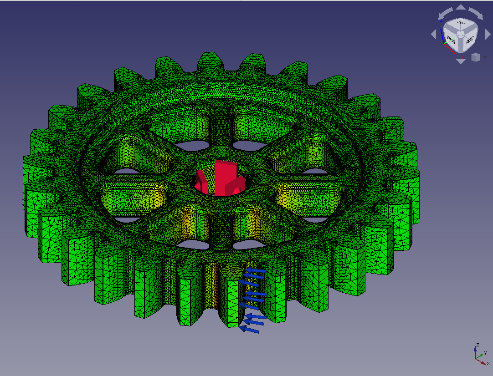
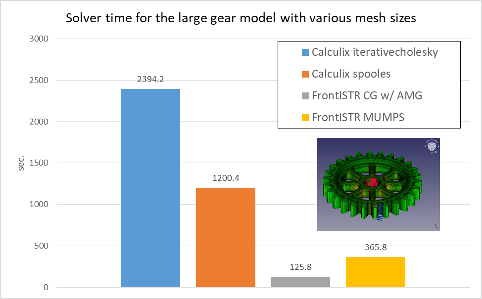

# Benchmark 05: Involute Gear 2

## Settings

- Objective: To compare the performance of CalculiX and FrontISTR on large scale model and various matrix solvers
- Model: Involute gear generated with the part design workbench
  - Analysis type: Static linear
  - 1,177,532 nodes, 793,270 elements(2nd order tetrahedron)
- Parameters:
  - Matrix solver settings
    - CalculiX: iterativecholesky(iterative), spooles(direct)
    - FrontISTR: CG w/ AMG preconditioner(iterative), MUMPS(direct)
- Measurement Environment
  - OS: Windows 10
  - CPU: Ryzen 3700X @3.60GHz 8cores x 1CPU
  - Memory: 64GB
  - FreeCAD 0.19.1 a88db11
  - FrontISTR v5.2 380f1690
  - FEM\_FrontISTR 8f57d2f3
  - Parallel settings
    - Calculix: `OMP_NUM_THREADS=8`
      - Note that Iterativecholesky solver runs sequentially. The other processes are executed in parallel.
    - FrontISTR: `n_process=8`
- Measurement method
  - Write Input Time(Tw): read from "Time: xx.x" at the bottom of the task panel when "Write input file" is complete
  - Solver time(Ts): read from "xx.x:  [FrontISTR/CalculiX] done without error!" message in FEM Console
  - Total time(Tt): read from "Time: xx.x" at the bottom of the task panel when "Run [FrontISTR/CalculiX]" is complete
  - Loading result time(Tr): Total time - Solve time
  - Max von Mises Stress: read from [FISTR|CCX]_Results

## Results

The performance(Solver time) of CalculiX and FrontISTR for the involute gear model is as follows:

The detailed result table including write Input time, result loading time, Mises stress, and iterative solver information is as follows:

| model | Solver    | Matrix Solver     | Tw       (sec) | Ts       (sec) | Tt       (sec) | Tr       (sec) | Max Mises      (MPa) | iter | residual | threshold | rem   |
| ----- | --------- | ----------------- | -------------- | -------------- | -------------- | -------------- | -------------------- | ---- | -------- | --------- | ----- |
| gear6 | Calculix  | iterativecholesky | 61.9           | 2394.2         | 2648.5         | 254.3          | 63.71                | 1245 | 9.27E-06 | 9.30E-06  |       |
| gear6 | Calculix  | spooles           | 64.3           | 1200.4         | N/A            | N/A            | N/A                  | N/A  | N/A      | N/A       | (\*1) |
| gear6 | FrontISTR | CG w/ AMG         | 98.4           | 125.8          | 199.7          | 73.9           | 63.63                | 75   | 8.26E-07 | 1.00E-06  |       |
| gear6 | FrontISTR | MUMPS             | 94.1           | 365.8          | 486.8          | 121            | 63.63                | N/A  | 1.44E-11 | N/A       |       |

\*Problem on frd file import. No nodes found in frd file.

