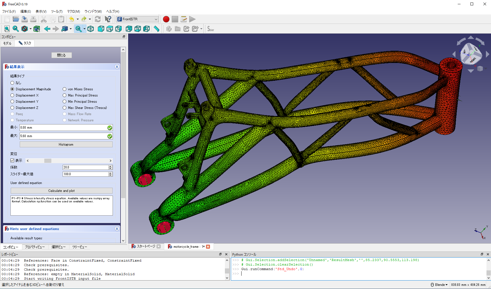
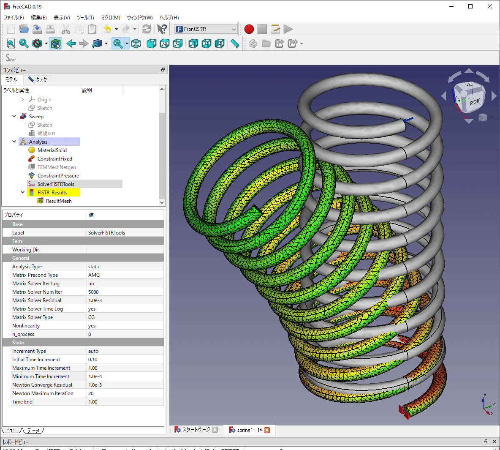

# Showcase of FEM_FrontISTR

## Motorcycle frame

- [Motorcycle frame](https://grabcad.com/library/motorcycle-frame-6)
- static linear analysis
- 644,415 nodes and 398,851 elements
- calculation time: 172sec (8cores)
- Intel Core i7-6700 @3.40GHz x 1CPU, 16.0GB Mem.

## Gear

- Gear
- static linear analysis
- 592,258 nodes and 405,960 elements
- calculation time: 181sec (8cores)
- AMD Ryzen 7 3700X @3.60GHz x 1CPU, 64.0GB Mem.

## Spring

- Spring
- static, large deformation, elastic linear material
- 115,593 nodes and 71,927 elements
- calculation time: 2652sec (8cores)
- AMD Ryzen 7 3700X @3.60GHz x 1CPU, 64.0GB Mem.

## How to add sample
More samples are welcome! Please PR/MR to add an item with the result contour image and the format below.

- model
- analysis type
- number of nodes and elements
- calculation time and used number of cores
- machine spec

