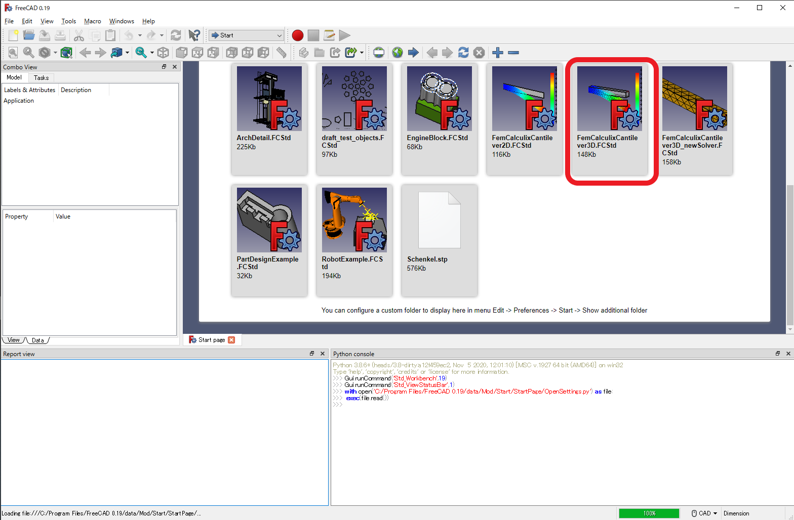
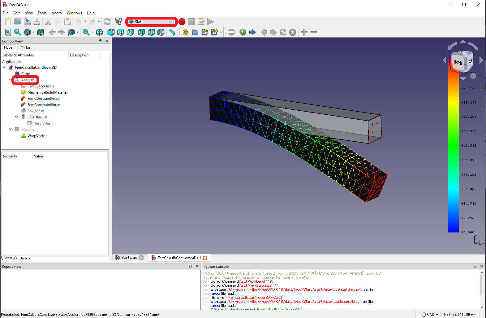
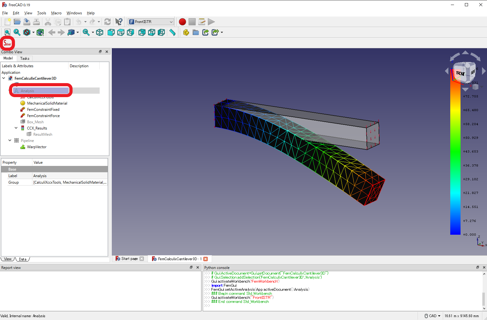
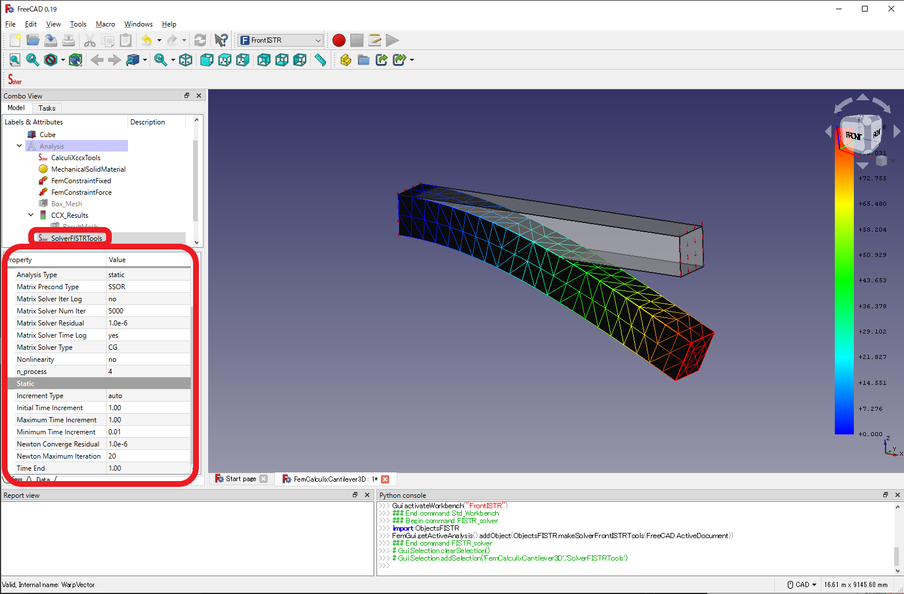
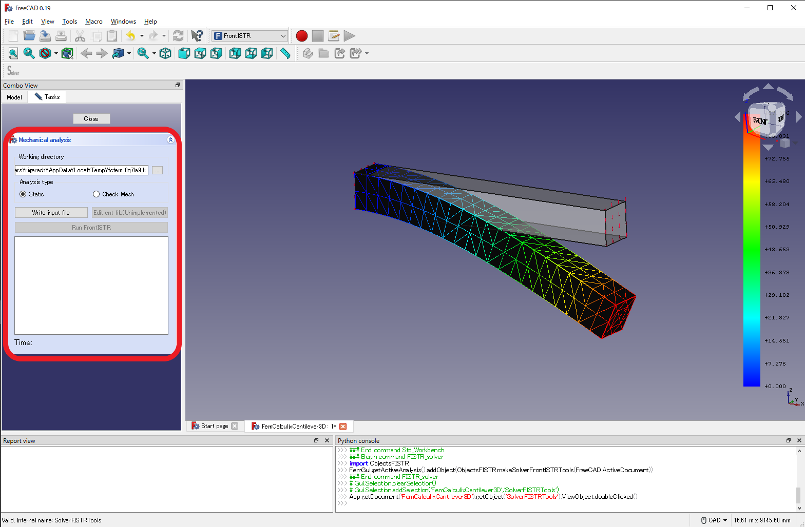
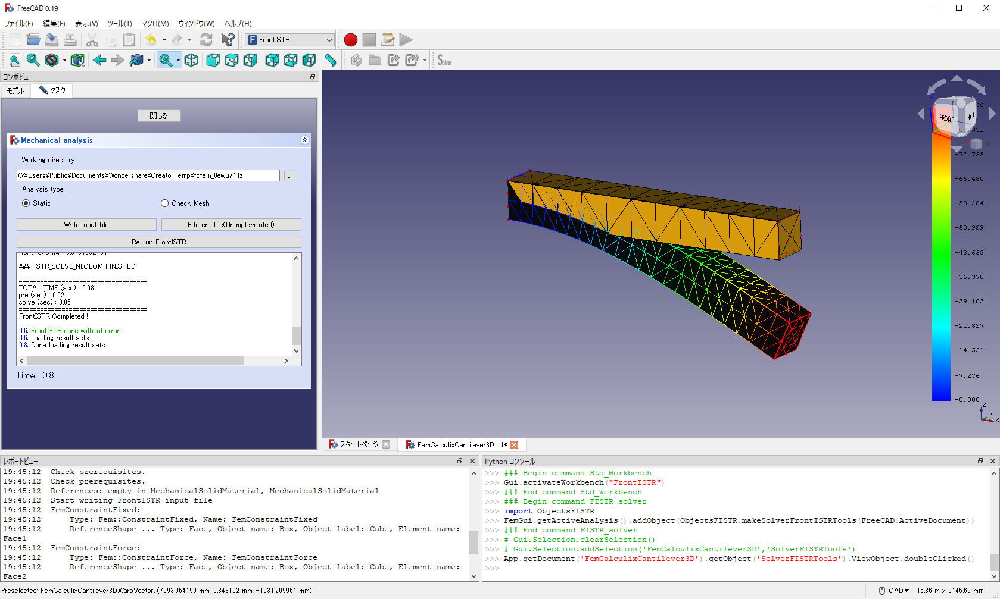
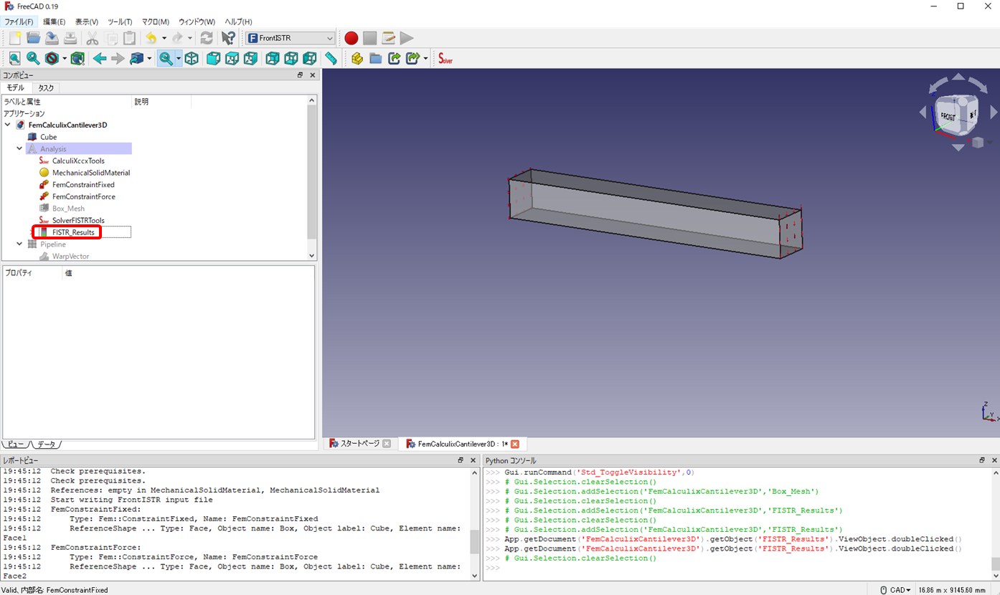
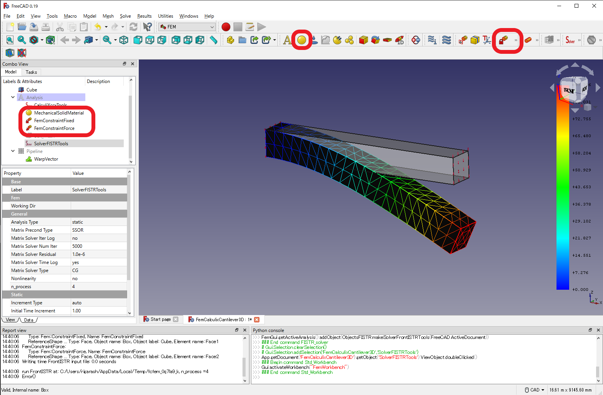

# Tutorial for running FEM_FrontISTR from GUI

FEM_FrontISTR performs analysis using the FrontISTR solver on the FEM model created with the FEM workbench. Since the procedures of setting up the analysis model with FEM workbench is the same as the FreeCAD standard, the explanation is omitted in this tutorial (for the method of setting up the analysis model, refer to, for example, [FEM_tutorial](https://wiki.freecadweb.org/FEM_tutorial)).

In this section, we will explain how to use the FrontISTR module, using the FEM sample included with [FreeCAD](https://www.freecadweb.org/) as an example to run it in FrontISTR.

1. Start [FreeCAD](https://www.freecadweb.org/) and click on the sample circled in red.
 
2. Right-click on the left red circle (Analysis) and select `Activate Analysis`. This will allow you to recalculate the analysis. At the same time, click on the top red circle (Start or FEM) and select `FrontISTR`.

3. Select the red circle (Analysis) in the lower left corner, and click the button (Solver) in the upper left corner. Then `SolverFISTRTools` will be created in Analysis. This is the FrontISTR solver object. Note that the executable binary of FrontISTR will be downloaded automatically at this stage.
 
4. Select `SolverFISTRTools` with the mouse to select the FrontISTR option in the red circle in the lower left corner. Then, double-click `SolverFISTRTools`.
 
5. After setting the `Working directory` freely, click `Write input file` to write the FrontISTR input file in the `Working directory`. After that, click `Run FrontISTR` to run the calculation. 
 
6. If the calculation finishes successfully, it will end with the output as shown in the figure.
 
7. Open `Box_Mesh_vis_psf.0001.pvtu` in the `Working directory` with [paraview](https://www.paraview.org/) and check the result. It can be confirmed that the results are consistent with the prepared results.
 
8. If you want to perform a calculation with different analysis conditions, click `Close` on the task to return to 4. and change the workbench from `FrontISTR` to `FEM`. For boundary conditions and properties, you can change the current settings by selecting inside the red circle on the left. You can also add new boundary conditions by selecting the button in the upper red circle. After setting the conditions, the calculation can be performed under different conditions by repeating the procedure from 4.

Translated with www.DeepL.com/Translator (free version)