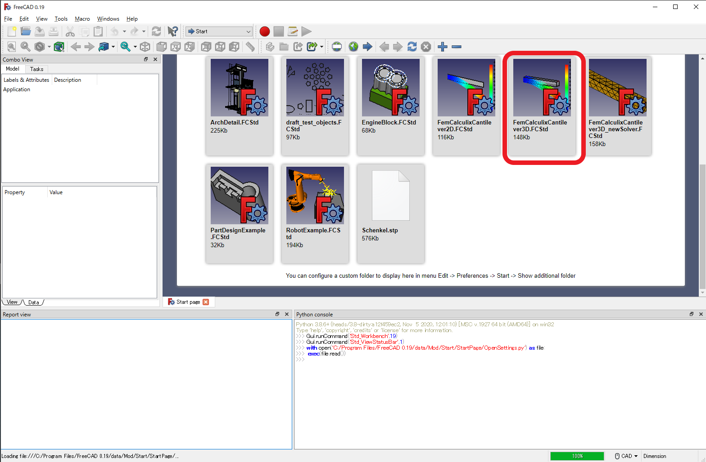
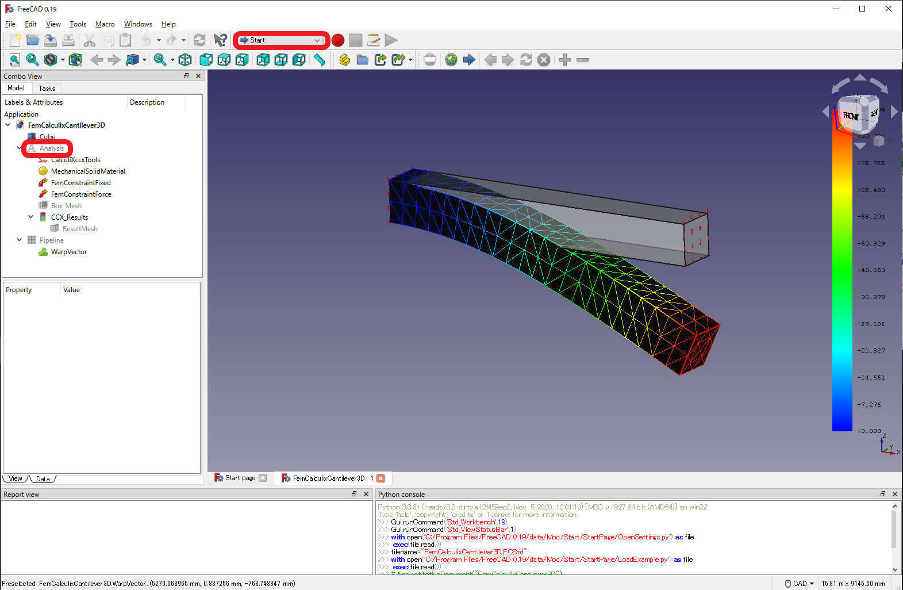
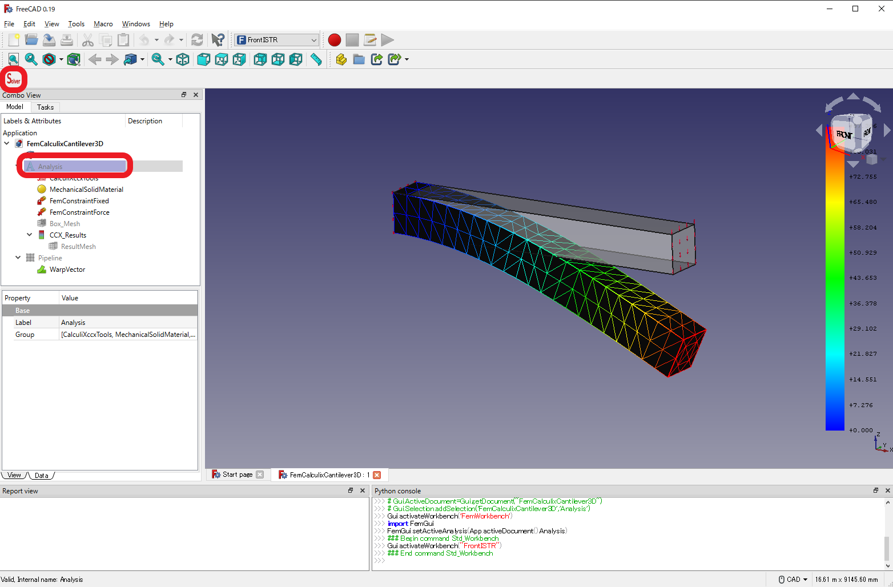
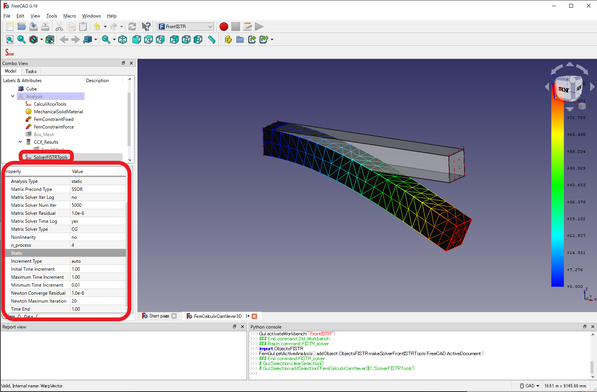
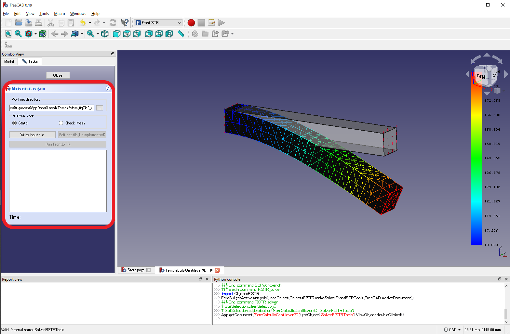
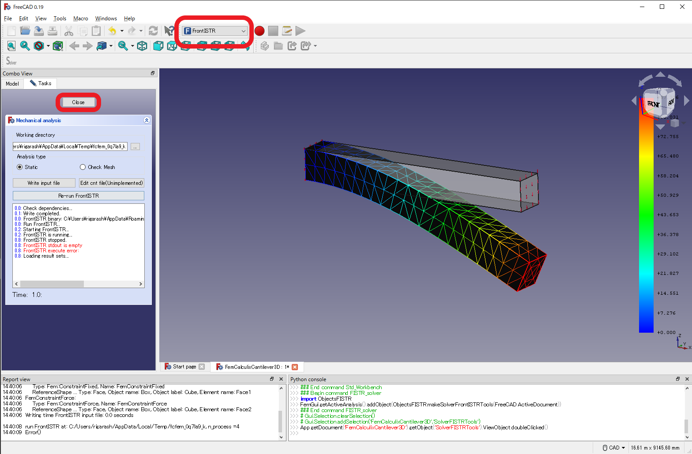
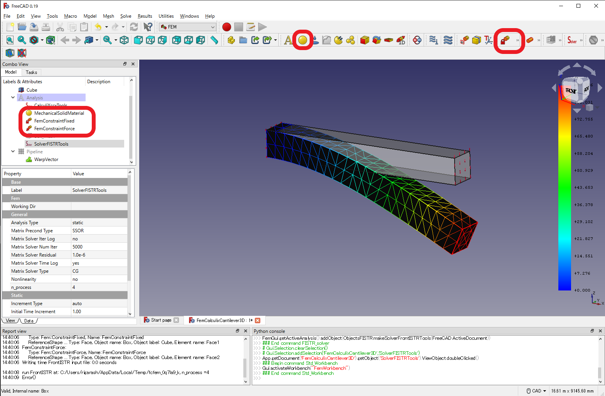

# GUI を用いた静解析のチュートリアル

ここでは [FreeCAD](https://www.freecadweb.org/) 付属の例題を用いてFrontISTRで計算を行う

1. [FreeCAD](https://www.freecadweb.org/)を起動し、赤角丸で囲った例題をクリックする。

2. 左の赤丸(Analysis)を右クリックし `Activate Analysis` を選択する。するとこの解析を再計算ができるようになる。同時に、上の赤丸(StartまたはFEM)をクリックして `FrontISTR` を選択する

3. 左下の赤丸(Analysis)を選択し、左上のボタン(Solver)をクリックする。すると `SolverFISTRTools` というものが Analysis の中にできる。これが FrontISTR ソルバオブジェクトである。なお、この段階でFrontISTRの実行バイナリを自動でダウンロードする。

4. `SolverFISTRTools` をマウスで選択すると、左下の赤丸のなかで FrontISTR のオプション選択ができる。その後、 `SolverFISTRTools` をダブルクリックする。

5. `Working directory` を自由に設定したあと、 `Write input file` をクリックすると、 `Working directory` の中にFrontISTRの入力ファイルが書きだされる。その後、 `Run FrontISTR` をクリックすると計算が実行される。

6. 計算が成功すると、図のような出力で計算が終わる。入出力ファイルの場所を確認したら、 `Close` をクリックして 4. に戻る。境界条件を変えた計算を行いたい場合などは、上の `FrontISTR` から `FEM` に変更する

7. 境界条件や物性を変えた計算を行う場合は、左の赤丸内を選択することで現在の設定を変更できる。また、上の赤丸内のボタンを選択することで新たな境界条件を付与することもできる。条件の設定後、4. からの手順を再度行うことで別条件での計算が可能である。
