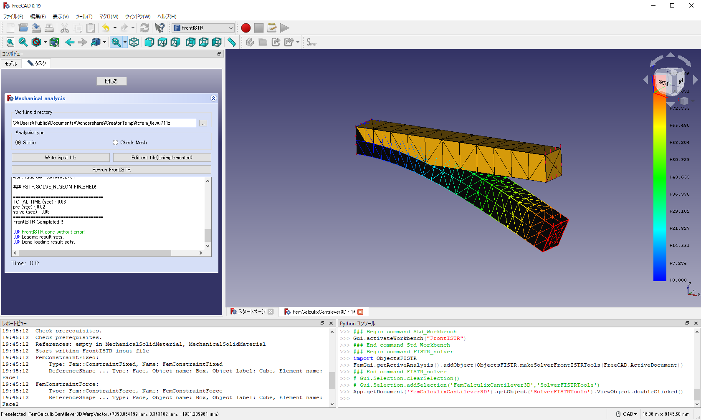

# GUI から FEM_FrontISTRを実行するチュートリアル

FEM_FrontISTRは、FreeCAD標準のFEMモジュールで作成した解析モデルに対し、FrontISTRソルバによる解析を実行する。解析モデルの設定方法はFreeCAD標準のFEM解析機能と同一であるので、本チュートリアルではその説明を省略する（解析モデルの設定方法は、例えば[FEM_tutorial](https://wiki.freecadweb.org/FEM_tutorial) などを参考にされたい）。

ここでは、 [FreeCAD](https://www.freecadweb.org/) 付属のFEMサンプルをFrontISTRで実行する場合を例に、FrontISTRモジュールの使用方法を説明する。

1. [FreeCAD](https://www.freecadweb.org/)を起動し、赤角丸で囲った例題をクリックする。

2. 左の赤丸(Analysis)を右クリックし `Activate Analysis` を選択する。するとこの解析を再計算ができるようになる。同時に、上の赤丸(StartまたはFEM)をクリックして `FrontISTR` を選択する

3. 左下の赤丸(Analysis)を選択し、左上のボタン(Solver)をクリックする。すると `SolverFISTRTools` というものが Analysis の中にできる。これが FrontISTR ソルバオブジェクトである。なお、この段階でFrontISTRの実行バイナリを自動でダウンロードする。

4. `SolverFISTRTools` をマウスで選択すると、左下の赤丸のなかで FrontISTR のオプション選択ができる。その後、 `SolverFISTRTools` をダブルクリックする。

5. `Working directory` を自由に設定したあと、 `Write input file` をクリックすると、 `Working directory` の中にFrontISTRの入力ファイルが書きだされる。その後、 `Run FrontISTR` をクリックすると計算が実行される。

6. 計算が成功すると、図のような出力で計算が終わる。

7. SolverFISTRToolsのタスクを閉じ、`CCX_Results`を消去する。解析結果を確認するために`FISTR_Results` をダブルクリックする。

8. SolverFISTRToolsのタスクから、結果表示を制御できる。図はMises応力の変形コンター図である。

9. 解析条件を変えた計算を行う場合は、タスクの`Close` をクリックして 4. に戻り、ワークベンチを `FrontISTR` から `FEM` に変更する。境界条件や物性については、左の赤丸内を選択することで現在の設定を変更できる。また、上の赤丸内のボタンを選択することで新たな境界条件を付与することもできる。条件の設定後、4. からの手順を再度行うことで別条件での計算が可能である。
