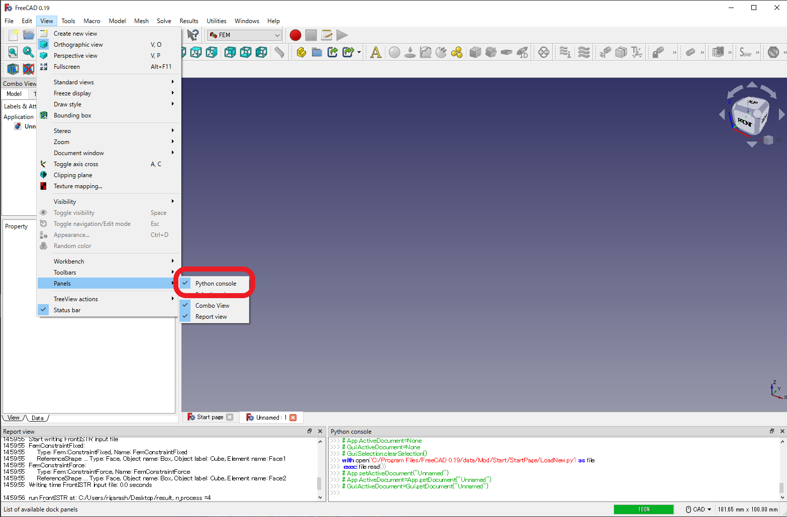
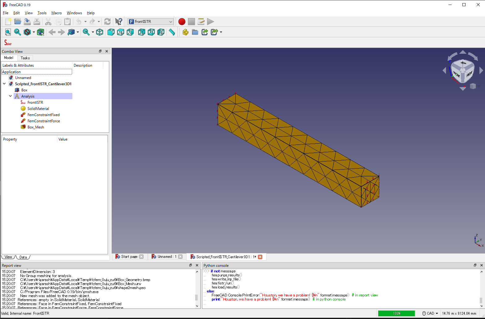

# Pythonスクリプトによる自動解析

FreeCADにはPython APIがあるため、Pythonによる自動実行が可能である。GUIを全く使わない全自動の実行もできるが、ここでは、GUIの上から一部の操作をpythonから実行させる。なお、[サンプルスクリプト](https://gitlab.com/FrontISTR-Commons/FEM_FrontISTR/-/blob/master/sample/scripting.py)はレポジトリに含まれている。

この[サンプルスクリプト](https://gitlab.com/FrontISTR-Commons/FEM_FrontISTR/-/blob/master/sample/scripting.py)はFreeCADの[FEM Tutorial Python](https://wiki.freecadweb.org/FEM_Tutorial_Python) をFrontISTRで動くように少し改変したものになっている。

1. FreeCADを起動して、Pythonコンソールが表示されていないときは、 View -> Panels -> Python consoleにチェックをいれる。すると、右下にPythonコンソールがあらわれ、ここに入力することでPythonからFreeCADの機能を実行することができる。

2. たとえば、[サンプルスクリプト](https://gitlab.com/FrontISTR-Commons/FEM_FrontISTR/-/blob/master/sample/scripting.py)をPythonコンソールにペーストすると、CADの作成、自動メッシング、境界条件の付与、FrontISTRによる計算が最後まで一気に実行できる。

